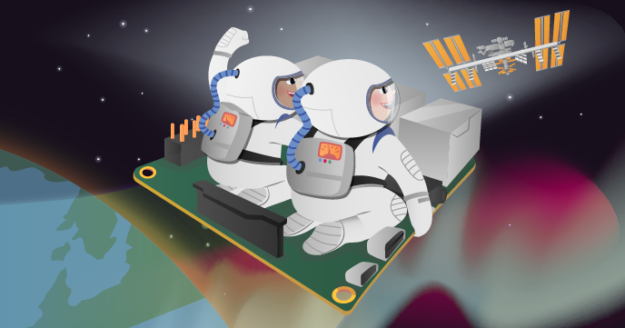

# A Guide to Astro Pi

This collection of guides and worksheets has been designed to provide you with a broad understanding of the Sense HAT and its capabilities. They could be used by teachers and students who have just entered the Astro Pi [Secondary School competition](http://astro-pi.org/secondary-school-competition/), or by anyone wanting to make the most of their Sense HAT. It will introduce you to what the board does, how to set it up, how to write your first program, and how to use the HAT's many features.

## Getting Started

- [Astro Pi: what is it?](board.md)
- [Assemble the Sense HAT](assemble.md)
- [Sense HAT: emulation](emulation.md)
- [Sense HAT: first program](program.md)
- [Sense HAT Python Cheatsheet](files/SenseHAT-Cheatsheet.pdf)
- [Getting started with Astro Pi learn resource](https://www.raspberrypi.org/learning/getting-started-with-astro-pi)
- [Sense HAT Pixel Workshop Worksheet](files/printable-worksheet.pdf)

## Sensors

- [Temperature](sensors/temperature.md)
- [Humidity](sensors/humidity.md)
- [Pressure](sensors/pressure.md)
- [Movement](sensors/movement.md)

## Inputs & Outputs

- [Joystick](inputs-outputs/joystick.md)
- [LED Matrix](inputs-outputs/led-matrix.md)
- [Buttons](inputs-outputs/buttons.md)

## Learn more about Astro Pi

- [The Official Astro Pi Website](http://astro-pi.org/)
- Martin O'Hanlon has built a [virtual Astro Pi](http://www.stuffaboutcode.com/2015/05/interactive-minecraft-astro-pi.html) (Sense HAT) in Minecraft which you can interact with to explore the functionality of the board.
