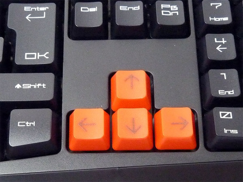

# The Joystick

## Keyboard mapping

1. The Astro Pi joystick is mapped to the four keyboard cursor keys with the middle click being mapped to the Return key. Meaning that moving the joystick has exactly the same effect as pressing those keys on the keyboard.

  

1. Remember that down on the joystick is with the HDMI port facing downwards.

## Testing the joystick

1. A Python Shell window will now appear.
1. Select `File > New Window`.
1. Type in the following code:

  ```python
  import pygame
  
  from pygame.locals import *
  from astro_pi import AstroPi
  
  pygame.init()
  pygame.display.set_mode((640, 480))
  ap = AstroPi()
  ap.clear()
  
  running = True
  
  while running:
      for event in pygame.event.get():
          print(event)
          if event.type == QUIT:
              running = False
              print("BYE")
  ```

1. Select `File > Save` and choose a file name for your program.
1. Then select `Run > Run module`.
1. A blank window will appear. Use the mouse to move it, drag the title bar, to one side of your screen so that the *Python Shell* window is also visible.
1. Keep the blank window selected but move the mouse over it, press and release some keys on the keyboard and waggle the Astro Pi joystick. Try pressing and holding a key for a moment and then releasing it a few seconds later. You should notice that two events occur when you do this. One for the key going down and another for the key being released. For this program we'll only use the KEY DOWN event.
1. Click the `x` in the corner of the blank pygame window. You should see the `BYE` message appear in the *Python Shell* window but the blank window does not close. Just minimise it.

## Detecting movement of joystick with code

Here is the pseudo code:

  - If a key is pressed DOWN
    - Turn OFF the LED using current `x` and `y`
    - If DOWN then add 1 to `y`
    - If UP then subtract 1 from `y`
    - If RIGHT then add 1 to `x`
    - If LEFT then subtract 1 from `x`
    - Turn ON the LED using updated `x` and `y`

1. Start by just adding the code for the DOWN key. Detele the `print(event)` command and insert the code below at the same indentation level:

  ```python
  if event.type == KEYDOWN:
      ap.set_pixel(x, y, 0, 0, 0)  # Black 0,0,0 means OFF
      
      if event.key == K_DOWN:
          y = y + 1
      
      ap.set_pixel(x, y, 255, 255, 255)
  ```

1. When you run the code you'll get an an error, your teacher will explain why it happens and how to fix it.
1. Where you have `if event.key == K_DOWN:` in your code, you can also use:

  - `K_UP`
  - `K_LEFT`
  - `K_RIGHT`
  - `K_RETURN`
