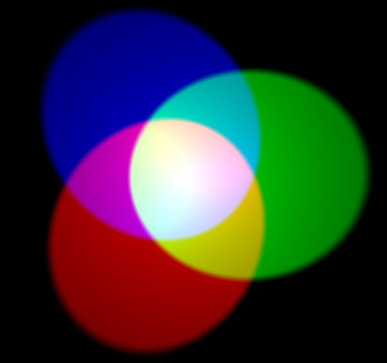

# Colour

In this activity you will:

- Learn about additive colour mixing
- Program various colours on the LED matrix

## Simple Colour mixing

  

1. In a new **Python 3** window, type in the following code:

  ```python
  from astro_pi import AstroPi
  ap = AstroPi()
  r = 255
  g = 255
  b = 255
  ap.clear((r, g, b))
  ```

1. Select `File > Save` and choose a file name for your program.
1. Then select `Run > Run module`.
1. The LED matrix will then go bright white.
1. The variables `r`, `g` and `b` represent the primary colours red, green and blue. The numbers they contain specify how bright each colour should be. They can be between zero and 255. So in the above code we've asked for maximum red, green and blue so the result is white.
1. Change the values to specify 255 red but zero green and blue. Then run the code again.
1. What other colours can you make?

## Changing foreground and background colours

1. This colour mixing system is used all throughout the Astro Pi programming module.
1. Open the code file from the previous lesson and modify it like so:

  ```python
  from astro_pi import AstroPi
  ap = AstroPi()
  ap.show_message("Hello my name is Tim Peake", text_colour=(255, 0, 0))
  ```

  Note the addition of the syntax `, text_colour=(255, 0, 0)`.
  
  Don't forget the comma!
  
1. You can also modify the background colour for the message like so:

  ```python
  from astro_pi import AstroPi
  ap = AstroPi()
  ap.show_message("Hello my name is Tim Peake", text_colour=(255, 0, 0), back_colour=(255,255,255))
  ```

  Don't forget the comma!
