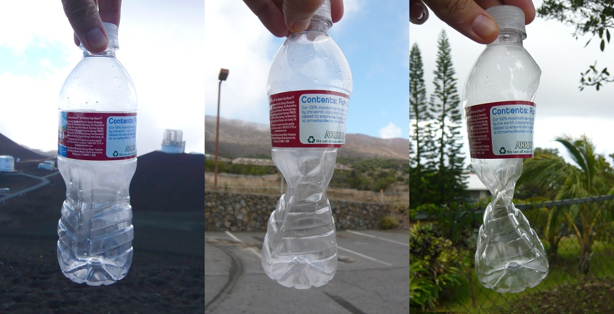
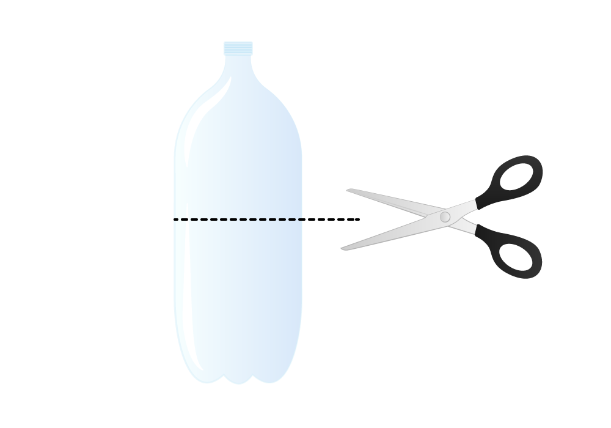
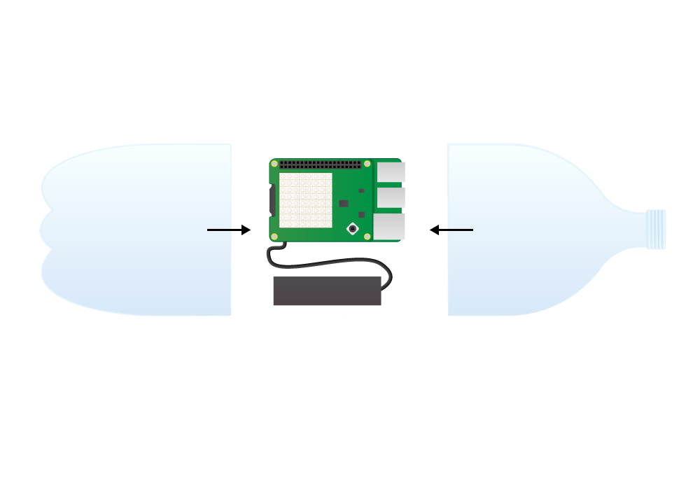
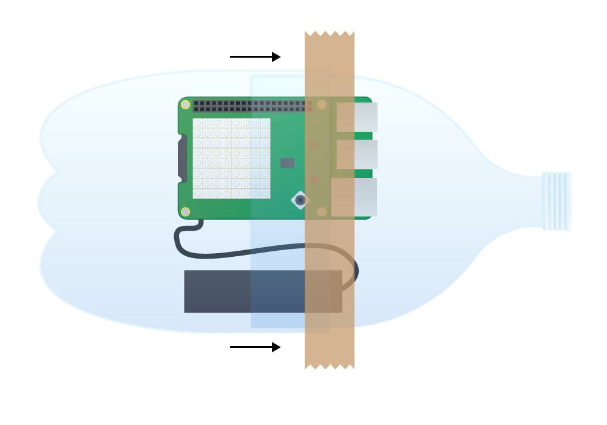
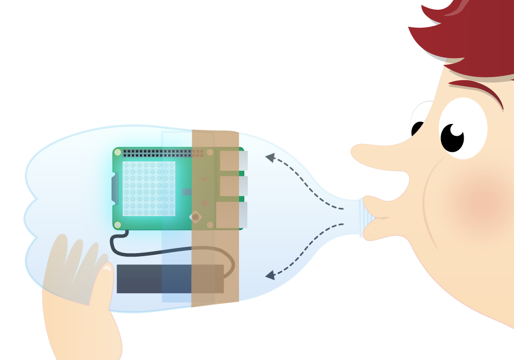

# Pressure

The Astro Pi HAT features a number of sensors including a pressure sensor. 

## What is pressure and how can it be measured?

Pressure, more generally speaking, is the force applied to a surface per unit of area. Imagine a brick sitting on a table. The force of its weight is being applied through the area of one of its faces. If you were then to balance the brick on a needle the force of its weight is concentrated on the area of the tip of the needle so the pressure being applied to the table is much higher.

Atmospheric pressure (also known as barometric pressure) is the pressure exerted by the weight of air in the atmosphere of Earth. Air pressure is pushing on every part of your body all the time. The pressure inside your body is the same as outside though so you don't feel anything. The unit of measurement is usually bars (or millibars). One bar is about equal to the atmospheric pressure on Earth at sea level (this would be 1000 millibars).

# Facts about Pressure:

- Atmospheric pressure decreases smoothly from the Earth's surface (sea level) up to the edge of space.

    

- The plastic bottle above was sealed at approximately 4300 meters altitude, and was crushed by the increase in atmospheric pressure at 2700 meters and then 300 meters as it was brought down towards sea level.
- Animal and plant life need atmospheric pressure in order to survice. The air above 8000 meters altitude is dangerous to humans and has been named the [Death Zone](http://simple.wikipedia.org/wiki/Death_zone) by mountain climbers. The summit of mount Everest is in this zone.
- The [Armstrong line](http://en.wikipedia.org/wiki/Armstrong_limit) is the altitude beyond which humans absolutely cannot survive in an unpressurised environment. This is between 18900 and 19350 meters where water boils at the normal temperature of the human body.
- The ISS maintains an orbit with an altitude of about 400 km (400000 meters). Way past the Armstrong line and right out in the vastness of space without any atmosphere (zero millibars). The air pressure inside the ISS though is maintained at about 1013 millibars which is nice and comfortable for the crew.

## What is the pressure?

1. Open **Python 3** from a terminal window as `sudo` by typing:
  
  ```bash
  sudo idel3 &
  ```
  
1. A Python Shell window will now appear. The terminal window can now be closed.
1. Select `File > New Window`.
1. Enter the following code:

  ```python
  from astro_pi import AstroPi
  
  ap = AstroPi()
  ap.clear()
  
  pressure = ap.get_pressure()
  print(pressure)
  ```

1. Select `File > Save` and choose a file name for your program.
1. Select `Run > Run module`.
1. If you see the error `Pressure Init Failed, please run as root / use sudo` (look on the last line of the message in red) it means you haven't followed the instructions above. Close everything and go back to step 1.
1. You should see something like this:

  ```bash
  Pressure sensor Init Succeeded
  1013.40380859
  ```
  
  If you get `0` just run the code again again. This sometimes happens when you use the pressure sensor for the first time.

1. Just before the `print(pressure)` line add this line below:

  ```python
  pressure = round(pressure, 1)
  ```

## Monitoring the pressure

1. It would be good to monitor the pressure as it changes, so let's put your code into a `while` loop and run it again.

  ```python
  while True:
      pressure = ap.get_pressure()
      pressure = round(pressure, 1)
      print(pressure)
  ```

1. Unfortunately it's not as easy to make it change as holding your thumb on the sensor or breathing on it, use the plastic bottle experiment below to test your code.

## The Plastic Bottle Experiment

The experiment involves sealing an Astro Pi inside a plastic bottle along with a mobile phone top up battery and then blowing into the bottle to increase the air pressure. Someone with a good pair of lungs should easily be able to increase the pressure to about 1100 millibars inside the bottle. So you'll first need to program the visual display. 

1. Watch [Dave Honess' video](https://www.youtube.com/watch?v=CHUukiKF3ew) about the plastic bottle experiment.
1. Take an empty two litre plastic bottle, discard the lid, and cut it in half across the middle as shown.

  
  
  Dry the inside of the bottle. Use a tissue or a dishcloth for this. Do not be tempted to use a heat gun or a hair dryer as they will warp the plastic.

1. Do a fit test. Try to fit the upper half inside the bottom half to join it back together. If you blow into the bottle now you'll feel the air coming back at you through the gaps in the side. Later you'll use tape to seal this. 
1. Shut down the Astro Pi leaving all the peripherals connected.
1. Disconnect the power supply and replace it with the mobile top up battery.
1. The Astro Pi should boot up as per usual allowing you to load up and run the code.
1. Disconnect all the peripherals apart from the battery (once the code is running) and put everything into the bottle. Make sure the top half goes inside the bottom half (so you'll feel the air coming back at you when you blow).

  

1. Use the tape to seal the join between the two halves of the bottle.

  

1. Blow into the bottle. You should feel air coming back at you if you've got any leaks so just use more tape to patch these.

  

1. Be aware that the moisture in your breath will steam up the inside of the bottle so stop before you make the Astro Pi damp or wet.
1. Remove the tape and separate the two halves of the bottle if you need to change the code. Just reconnecting the peripherals to do a quick edit should work fine.


## Display the pressure on the LED Matrix

Below is the code that was used in the video. It can cope with 1000 to 1100 millibars. So that’s 100 millibars of range. We know that the LED matrix colours have a range of 0 to 255. So the first thing it does is create a ratio between the pressure range and the colour range. The plan is then to multiply the measured pressure by that ratio to get the colour. You have to subtract 1000 from the measured pressure to make this work though (so you're multiplying a number between 0 and 100 by the ratio). It then clamps the colour to a maximum of 255 incase there is someone with very strong lungs who can drive the pressure higher than 1100 millibars.

  ```python
  from astro_pi import AstroPi
  
  ap = AstroPi()
  ap.clear()
  
  ratio = 255 / 100.0
  
  while True:
      pressure = ap.get_pressure()
      pressure = round(pressure, 1) - 1000
      blue = int(ratio * pressure)
      if blue > 255:
          blue = 255
      ap.clear((0, 0, blue))
